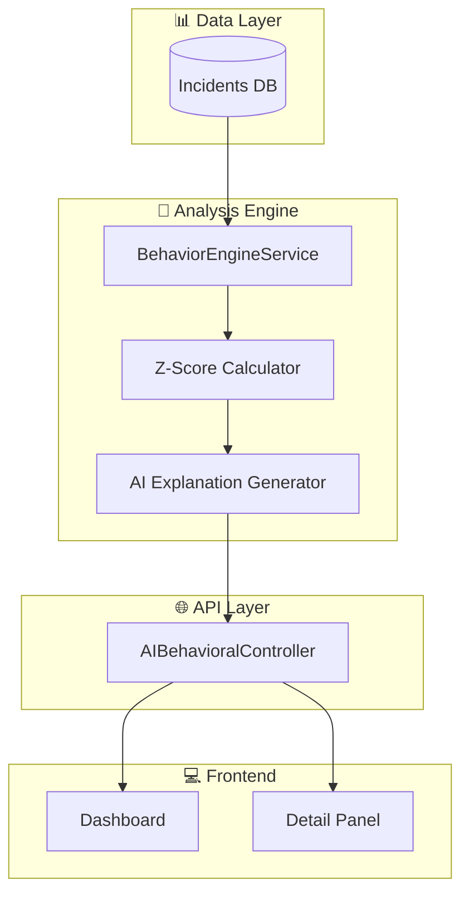
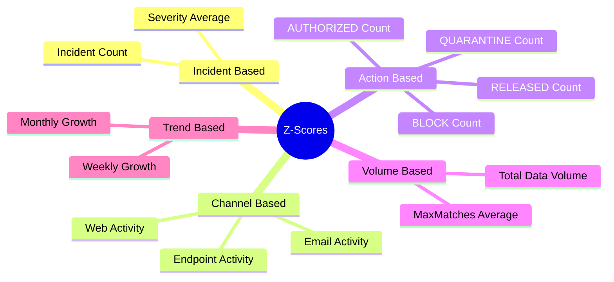
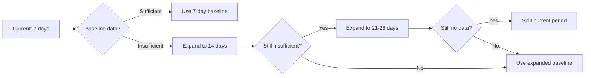
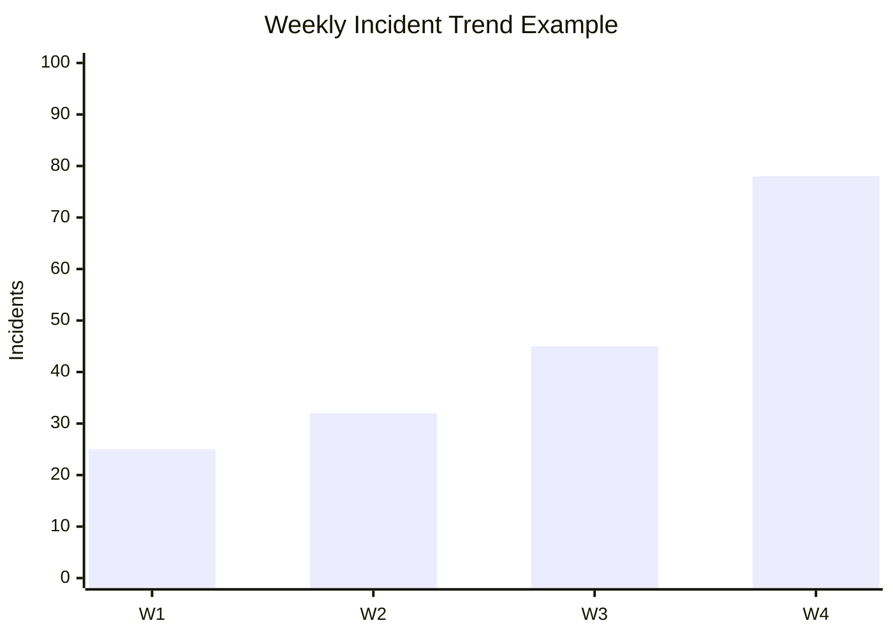

# AI Behavioral Analysis - Technical Documentation

## 1. System Overview

AI Behavioral Analysis sistemi, kullanıcı ve varlık davranışlarındaki anomalileri **istatistiksel Z-score yöntemi** ile tespit eder.

### Architecture



---

## 2. Z-Score Algorithm

### 2.1 Core Formula

$$Z = \frac{X - \mu}{\sigma}$$

| Symbol | Meaning | Description |
|--------|---------|-------------|
| **X** | Current Value | Mevcut dönemdeki gözlem değeri |
| **μ** | Mean | Baseline döneminin ortalaması |
| **σ** | Std Dev | Baseline döneminin standart sapması |

### 2.2 Interpretation

| Z-Score | Anomaly Level | Action |
|---------|---------------|--------|
| Z ≥ 3.0 | 🔴 **CRITICAL** | Acil müdahale gerekli |
| Z ≥ 2.0 | 🔴 **HIGH** | Detaylı inceleme |
| Z ≥ 1.0 | 🟡 **MEDIUM** | İzleme altına al |
| Z < 1.0 | 🟢 **LOW** | Normal davranış |

---

## 3. Analysis Dimensions

### 3.1 Entity Types

| Entity | Description | Example |
|--------|-------------|---------|
| **User** | Bireysel kullanıcı davranışı | `john.doe@company.com` |
| **Channel** | İletişim kanalı aktivitesi | `Email`, `Web`, `Endpoint` |
| **Department** | Departman bazlı analiz | `Finance`, `IT`, `HR` |
| **Destination** | Hedef sistem/URL | `dropbox.com`, `gmail.com` |
| **Rule** | DLP kuralı tetiklenme | `Credit Card Detection` |

### 3.2 Z-Score Metrics



---

## 4. Risk Score Calculation

### 4.1 Unified Calculation (All Views)

Tüm analiz metotları aynı hesaplama mantığını kullanır:

```
Final_Risk_Score = Base_Risk_Score × Threat_Multiplier
```

| Component | Method | Description |
|-----------|--------|--------------|
| **Metrics** | `CalculateEnhancedMetrics()` | Incident, action, channel, matches istatistikleri |
| **Z-Scores** | `CalculateAllZScores()` | 11 farklı Z-score metrikleri |
| **Base Score** | `CalculateEnhancedRiskScore()` | Tier-based skor (0-100) |
| **Multiplier** | `CalculateThreatProfileMultiplier()` | Action bazlı çarpan (0.2-1.0) |

### 4.2 Tier System

| Tier | Score Range | Color | Requirements |
|------|-------------|-------|--------------|
| **CRITICAL** | 85-100 | 🟤 Dark Red | Multiple extreme signals |
| **HIGH** | 65-84 | 🔴 Red | Clear anomaly pattern |
| **MEDIUM** | 40-64 | 🟡 Yellow | Some anomaly signals |
| **LOW** | 0-39 | 🟢 Green | Normal behavior |

### 4.3 Threat Profile Multiplier

Action türlerine göre risk skoru düzeltilir:

| Action | Weight | Risk Impact |
|--------|--------|-------------|
| **BLOCK** | 1.0 | Tam risk - ciddi ihlal |
| **QUARANTINE** | 0.8 | Yüksek risk |
| **AUTHORIZED** | 0.2 | Düşük risk - onaylı |
| **RELEASED** | 0.2 | Düşük risk - temizlendi |

**Örnek:**
- Kullanıcı %100 AUTHORIZED action'a sahip
- Base Risk Score: 100 (yüksek Z-score nedeniyle)
- Threat Multiplier: 0.2
- Final Score: 100 × 0.2 = **20** (LOW)

### 4.4 Enhanced Scoring Algorithm

```python
# Score 100: Requires MULTIPLE extreme anomalies
if extreme_count >= 2:  # Z >= 4.0
    return 100
if high_count >= 3 and medium_count >= 4:  # Z >= 3.0, Z >= 2.0
    return 100

# Score 95: One extreme + additional highs
if extreme_count >= 1 and high_count >= 2:
    return 95

# Score 85+: Requires pattern, not single spike
if max_z >= 4.0 or high_count >= 2:
    return 85
```

### 4.5 Weekly Trend Z-Score (Log-Scale)

```python
# Prevents extreme values from simple percentage changes
# Example: 2 -> 15 incidents
raw_growth = (15 - 2) / 2  # = 6.5 (650%)
scaled_growth = log(1 + 6.5)  # = 2.01 (compressed)
z_score = scaled_growth / 0.5  # = 4.02
final_z = clamp(z_score, -5.0, 5.0)  # Max 5.0
```

---

## 5. Baseline Period Selection

### 5.1 Adaptive Baseline



### 5.2 Split Period Analysis

Baseline verisi yoksa, current period ikiye bölünür:
- İlk yarı → Pseudo-baseline
- İkinci yarı → Current comparison

---

## 6. Action-Based Analysis

### 6.1 Action Categories

| Action | Category | Z-Score Weight | Threat Weight |
|--------|----------|----------------|---------------|
| **BLOCK** | High Threat | 1.0x | 1.0 |
| **QUARANTINE** | High Threat | 1.0x | 0.8 |
| **AUTHORIZED** | Low Threat | 0.2x | 0.2 |
| **RELEASED** | Low Threat | 0.2x | 0.2 |

### 6.2 Dual Impact System

**Z-Score Weight**: Z-score hesaplamasında ağırlık
- High threat action'ların Z-score'ları tam değerde kullanılır
- Low threat action'ların Z-score'ları 0.2 ile çarpılır

**Threat Weight**: Final risk skorunda çarpan
- Kullanıcının action profile'ına göre risk skoru düzeltilir
- %100 AUTHORIZED = 0.2 multiplier → risk %80 azalır

### 6.3 Z-Score Calculation

```
Z_block = (current_block_count - baseline_block_mean) / baseline_block_std × HIGH_THREAT_WEIGHT
Z_authorized = (current_auth_count - baseline_auth_mean) / baseline_auth_std × LOW_THREAT_WEIGHT
```

**Örnek:**
- Baseline: Günlük 2 BLOCK (std: 1.5)
- Current: Günlük 8 BLOCK
- Z = (8 - 2) / 1.5 × 1.0 = **4.0** → 🔴 CRITICAL

---

## 7. Trend Analysis

### 7.1 Weekly Trend

```
Weekly_Growth = (This_Week - Last_Week) / Last_Week × 100
Z_Weekly = (Growth_Rate - Avg_Growth) / Std_Growth
```

### 7.2 Monthly Trend

- 4 haftalık window
- Her hafta için incident count
- Trend direction ve magnitude hesaplama



---

## 8. User-Destination Pattern

### 8.1 Diversity Analysis

```
Destination_Diversity = Unique_Destinations / Total_Incidents
```

| Pattern | Risk | Interpretation |
|---------|------|----------------|
| High Diversity + Low Incidents | 🟡 Medium | Geniş tarama - keşif davranışı |
| Low Diversity + High Incidents | 🔴 High | Odaklanmış sızıntı - veri çalma |
| Balanced | 🟢 Low | Normal kullanım |

### 8.2 New Destination Detection

Baseline'da olmayan yeni destination'lara erişim → Anomali flag

---

## 9. MaxMatches Analysis

### 9.1 Logic

| Scenario | Risk |
|----------|------|
| Few incidents, high matches | 🔴 High - Yoğun veri sızıntısı |
| Many incidents, low matches | 🟡 Medium - Sık ama küçük ihlaller |
| Many incidents, high matches | 🔴 Critical - Ciddi veri kaybı |

### 9.2 Calculation

```
Avg_Matches = Total_Matches / Incident_Count
Z_Matches = (Current_Avg - Baseline_Avg) / Baseline_Std
```

---

## 10. API Endpoints

| Endpoint | Method | Description |
|----------|--------|-------------|
| `/api/ai-behavioral/overview` | GET | Tüm entity'lerin özeti |
| `/api/ai-behavioral/analyze` | POST | Belirli entity analizi |
| `/api/ai-behavioral/entity/{type}/{id}` | GET | Entity detay bilgisi |
| `/api/ai-behavioral/anomalies` | GET | Top anomaliler listesi |
| `/api/ai-behavioral/entity/{type}/{id}/trends` | GET | Trend verileri (NEW) |
| `/api/ai-behavioral/entity/{type}/{id}/detail` | GET | Detaylı analiz (NEW) |

---

## 11. Frontend UI Components

### 11.1 Overview Dashboard

- Summary cards (High/Medium/Low counts)
- Entity tabs (Users, Channels, Departments, etc.)
- Filterable entity list

### 11.2 Detail Analysis Panel

- Risk score gauge
- Weekly/Monthly trend charts
- Action breakdown pie chart
- Z-score table
- Top incidents table

---

## 12. Performance Optimization

| Technique | Benefit |
|-----------|---------|
| **Batch Query** | Tek sorguda tüm incidents |
| **Parallel Analysis** | Entity'ler paralel analiz |
| **Memory Cache** | 5 dakika overview cache |
| **Lazy AI Generation** | Sadece HIGH/MEDIUM için AI |

---

## 13. Example Analysis Output

```json
{
  "entityType": "user",
  "entityId": "john.doe@company.com",
  "riskScore": 85,
  "anomalyLevel": "high",
  "analysisMetadata": {
    "current_incident_count": 45,
    "baseline_incident_count": 12,
    "z_score_incident_count": 3.2,
    "z_score_action_block": 4.1,
    "z_score_max_matches": 2.8,
    "z_score_weekly_trend": 1.5,
    "weekly_growth_rate": 156,
    "top_destinations": ["dropbox.com", "gmail.com"],
    "destination_diversity": 0.85
  },
  "aiExplanation": "User shows 267% increase in BLOCK actions...",
  "aiRecommendation": "Immediate investigation recommended..."
}
```

---

## 14. Future Enhancements

- [ ] Machine Learning based anomaly detection
- [ ] Peer group comparison (same department, same role)
- [ ] Time-based patterns (working hours vs off-hours)
- [ ] Geolocation anomaly detection
- [ ] Integration with SIEM systems
