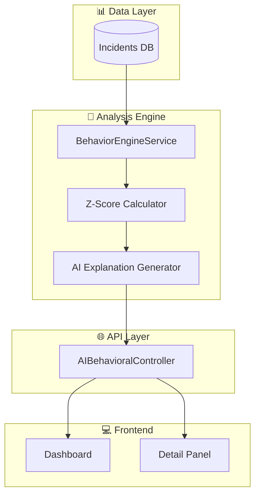
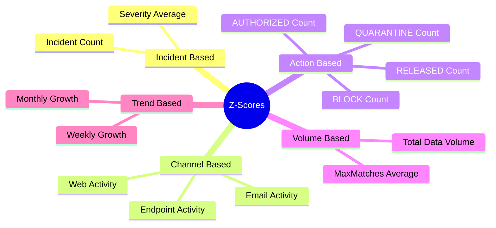
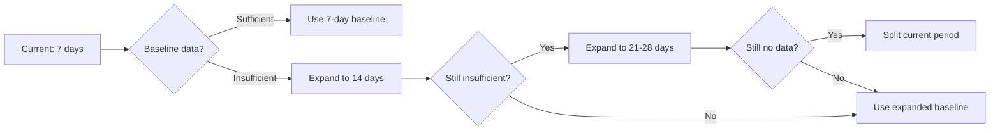
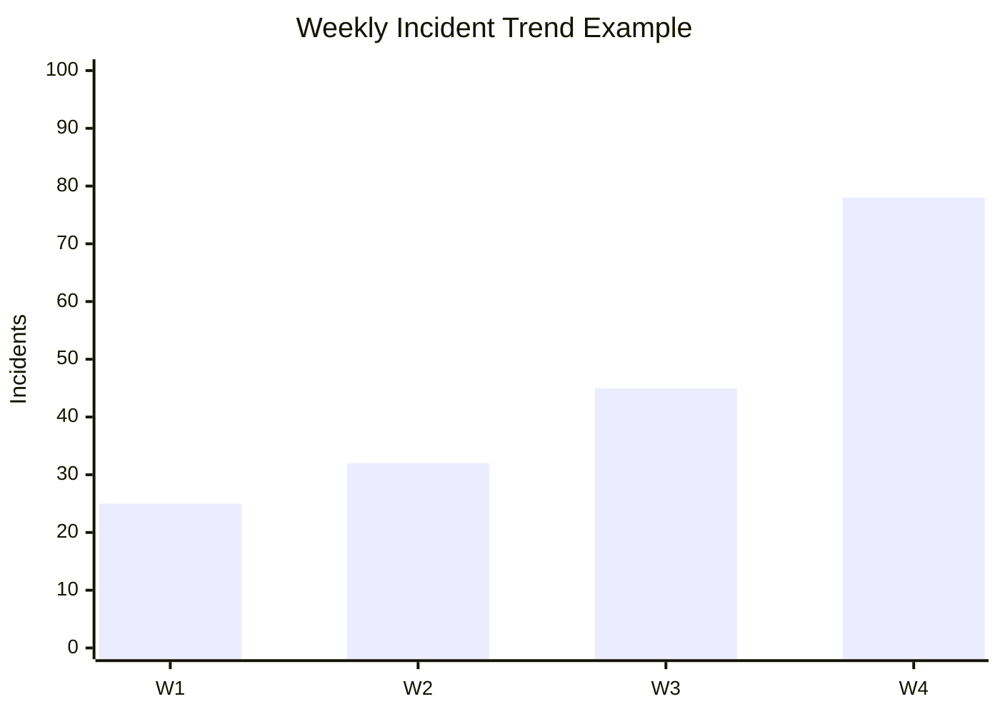

# AI Behavioral Analysis - Technical Documentation

## 1. System Overview

AI Behavioral Analysis sistemi, kullanıcı ve varlık davranışlarındaki anomalileri **istatistiksel Z-score yöntemi** ile tespit eder.

### Architecture



---

## 2. Z-Score Algorithm

### 2.1 Core Formula

$$Z = \frac{X - \mu}{\sigma}$$

| Symbol | Meaning | Description |
|--------|---------|-------------|
| **X** | Current Value | Mevcut dönemdeki gözlem değeri |
| **μ** | Mean | Baseline döneminin ortalaması |
| **σ** | Std Dev | Baseline döneminin standart sapması |

### 2.2 Interpretation

| Z-Score | Anomaly Level | Action |
|---------|---------------|--------|
| Z ≥ 3.0 | 🔴 **CRITICAL** | Acil müdahale gerekli |
| Z ≥ 2.0 | 🔴 **HIGH** | Detaylı inceleme |
| Z ≥ 1.0 | 🟡 **MEDIUM** | İzleme altına al |
| Z < 1.0 | 🟢 **LOW** | Normal davranış |

---

## 3. Analysis Dimensions

### 3.1 Entity Types

| Entity | Description | Example |
|--------|-------------|---------|
| **User** | Bireysel kullanıcı davranışı | `john.doe@company.com` |
| **Channel** | İletişim kanalı aktivitesi | `Email`, `Web`, `Endpoint` |
| **Department** | Departman bazlı analiz | `Finance`, `IT`, `HR` |
| **Destination** | Hedef sistem/URL | `dropbox.com`, `gmail.com` |
| **Rule** | DLP kuralı tetiklenme | `Credit Card Detection` |

### 3.2 Z-Score Metrics



---

## 4. Risk Score Calculation

### 4.1 Algorithm

```python
# Pseudocode
all_z_scores = [
    z_incident_count,
    z_severity,
    z_channel_email,
    z_channel_web,
    z_channel_endpoint,
    z_action_block,
    z_action_quarantine,
    z_max_matches,
    z_weekly_trend,
    z_monthly_trend
]

max_z = max(abs(z) for z in all_z_scores)

if max_z >= 4.0: risk_score = 100
elif max_z >= 3.0: risk_score = 85
elif max_z >= 2.5: risk_score = 75
elif max_z >= 2.0: risk_score = 65
elif max_z >= 1.5: risk_score = 50
elif max_z >= 1.0: risk_score = 40
else: risk_score = 20
```

### 4.2 Anomaly Classification

| Risk Score | Level | Color |
|------------|-------|-------|
| 80-100 | HIGH | 🔴 Red |
| 50-79 | MEDIUM | 🟡 Yellow |
| 0-49 | LOW | 🟢 Green |

---

## 5. Baseline Period Selection

### 5.1 Adaptive Baseline



### 5.2 Split Period Analysis

Baseline verisi yoksa, current period ikiye bölünür:
- İlk yarı → Pseudo-baseline
- İkinci yarı → Current comparison

---

## 6. Action-Based Analysis

### 6.1 Policy Attitudes

| Action | Interpretation | Z-Score Weight |
|--------|----------------|----------------|
| **BLOCK** | Ciddi ihlal, engellendi | 1.5x |
| **QUARANTINE** | Şüpheli, karantinaya alındı | 1.3x |
| **AUTHORIZED** | Onaylandı | 0.8x |
| **RELEASED** | Karantinadan çıkarıldı | 1.0x |

### 6.2 Calculation

```
Z_block = (current_block_count - baseline_block_mean) / baseline_block_std
```

**Örnek:**
- Baseline: Günlük 2 BLOCK (std: 1.5)
- Current: Günlük 8 BLOCK
- Z = (8 - 2) / 1.5 = **4.0** → 🔴 CRITICAL

---

## 7. Trend Analysis

### 7.1 Weekly Trend

```
Weekly_Growth = (This_Week - Last_Week) / Last_Week × 100
Z_Weekly = (Growth_Rate - Avg_Growth) / Std_Growth
```

### 7.2 Monthly Trend

- 4 haftalık window
- Her hafta için incident count
- Trend direction ve magnitude hesaplama



---

## 8. User-Destination Pattern

### 8.1 Diversity Analysis

```
Destination_Diversity = Unique_Destinations / Total_Incidents
```

| Pattern | Risk | Interpretation |
|---------|------|----------------|
| High Diversity + Low Incidents | 🟡 Medium | Geniş tarama - keşif davranışı |
| Low Diversity + High Incidents | 🔴 High | Odaklanmış sızıntı - veri çalma |
| Balanced | 🟢 Low | Normal kullanım |

### 8.2 New Destination Detection

Baseline'da olmayan yeni destination'lara erişim → Anomali flag

---

## 9. MaxMatches Analysis

### 9.1 Logic

| Scenario | Risk |
|----------|------|
| Few incidents, high matches | 🔴 High - Yoğun veri sızıntısı |
| Many incidents, low matches | 🟡 Medium - Sık ama küçük ihlaller |
| Many incidents, high matches | 🔴 Critical - Ciddi veri kaybı |

### 9.2 Calculation

```
Avg_Matches = Total_Matches / Incident_Count
Z_Matches = (Current_Avg - Baseline_Avg) / Baseline_Std
```

---

## 10. API Endpoints

| Endpoint | Method | Description |
|----------|--------|-------------|
| `/api/ai-behavioral/overview` | GET | Tüm entity'lerin özeti |
| `/api/ai-behavioral/analyze` | POST | Belirli entity analizi |
| `/api/ai-behavioral/entity/{type}/{id}` | GET | Entity detay bilgisi |
| `/api/ai-behavioral/anomalies` | GET | Top anomaliler listesi |
| `/api/ai-behavioral/entity/{type}/{id}/trends` | GET | Trend verileri (NEW) |
| `/api/ai-behavioral/entity/{type}/{id}/detail` | GET | Detaylı analiz (NEW) |

---

## 11. Frontend UI Components

### 11.1 Overview Dashboard

- Summary cards (High/Medium/Low counts)
- Entity tabs (Users, Channels, Departments, etc.)
- Filterable entity list

### 11.2 Detail Analysis Panel

- Risk score gauge
- Weekly/Monthly trend charts
- Action breakdown pie chart
- Z-score table
- Top incidents table

---

## 12. Performance Optimization

| Technique | Benefit |
|-----------|---------|
| **Batch Query** | Tek sorguda tüm incidents |
| **Parallel Analysis** | Entity'ler paralel analiz |
| **Memory Cache** | 5 dakika overview cache |
| **Lazy AI Generation** | Sadece HIGH/MEDIUM için AI |

---

## 13. Example Analysis Output

```json
{
  "entityType": "user",
  "entityId": "john.doe@company.com",
  "riskScore": 85,
  "anomalyLevel": "high",
  "analysisMetadata": {
    "current_incident_count": 45,
    "baseline_incident_count": 12,
    "z_score_incident_count": 3.2,
    "z_score_action_block": 4.1,
    "z_score_max_matches": 2.8,
    "z_score_weekly_trend": 1.5,
    "weekly_growth_rate": 156,
    "top_destinations": ["dropbox.com", "gmail.com"],
    "destination_diversity": 0.85
  },
  "aiExplanation": "User shows 267% increase in BLOCK actions...",
  "aiRecommendation": "Immediate investigation recommended..."
}
```

---

## 14. Future Enhancements

- [ ] Machine Learning based anomaly detection
- [ ] Peer group comparison (same department, same role)
- [ ] Time-based patterns (working hours vs off-hours)
- [ ] Geolocation anomaly detection
- [ ] Integration with SIEM systems
