# DLP Risk Analyzer - Mermaid Diyagramları

> **Sunum için:** [Mermaid Live Editor](https://mermaid.live/) üzerinden diyagram kodunu yapıştırın ve PNG/SVG olarak indirin.

---

## 1. Dashboard Flow

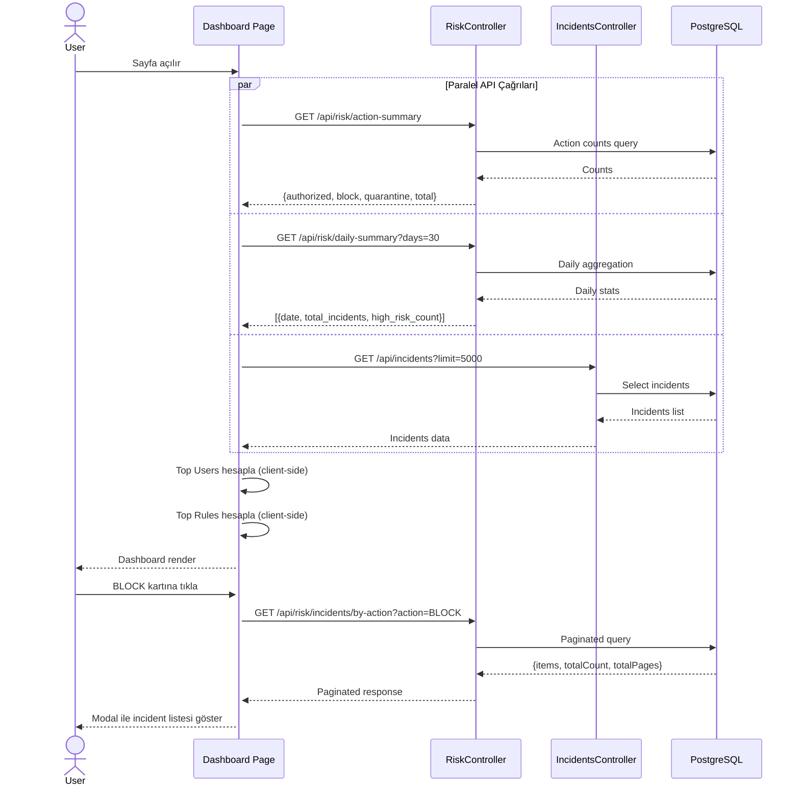

---

## 2. Investigation Flow

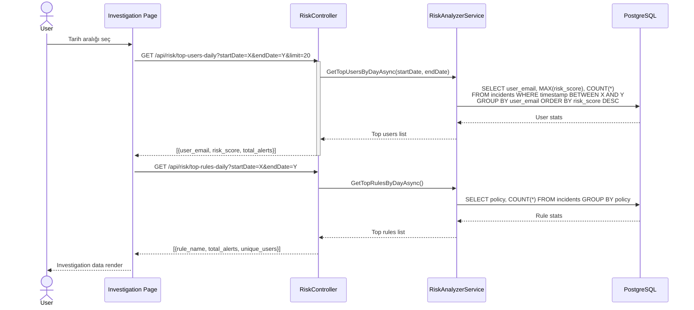

---

## 3. Reports Flow

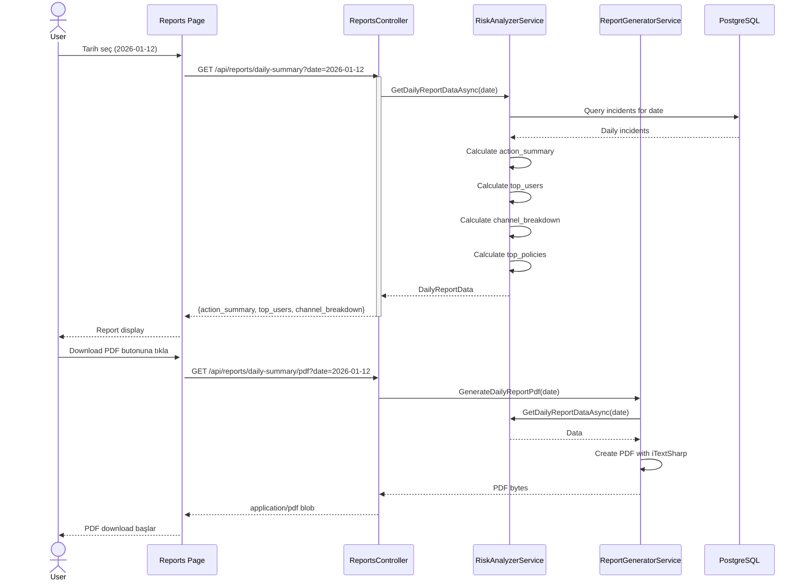

---

## 4. Users Flow

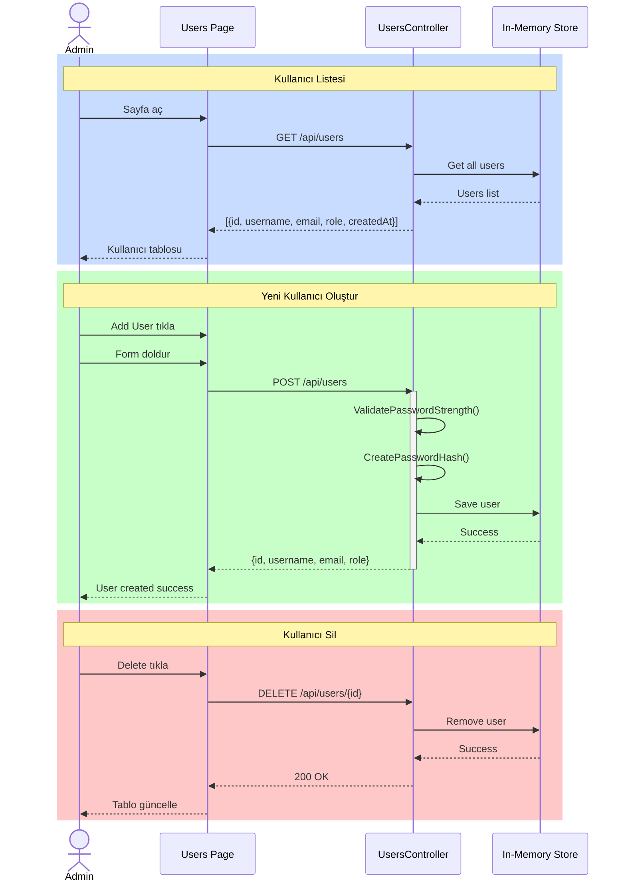

---

## 5. AI Behavioral Flow

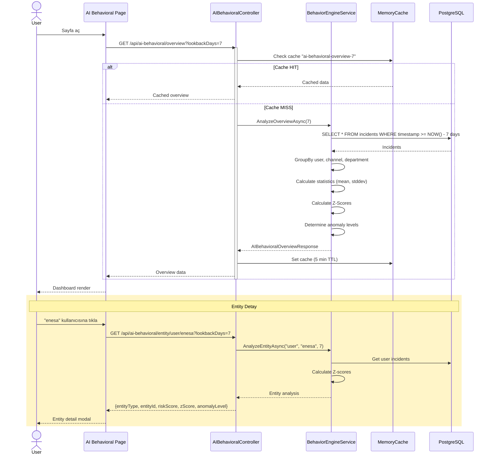

---

## 6. Settings Flow

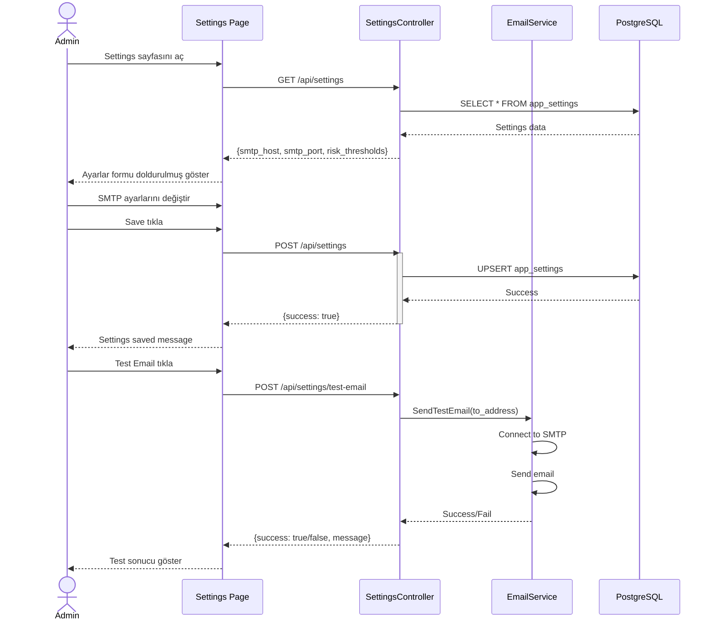

---

## 7. AI Settings Flow

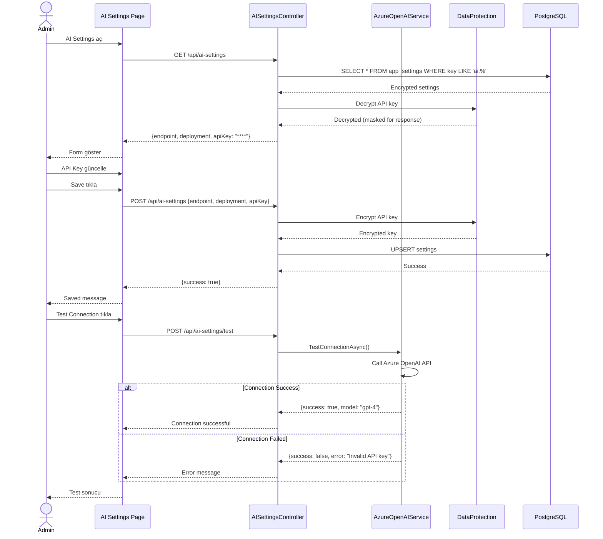

---

## 8. Logs Flow

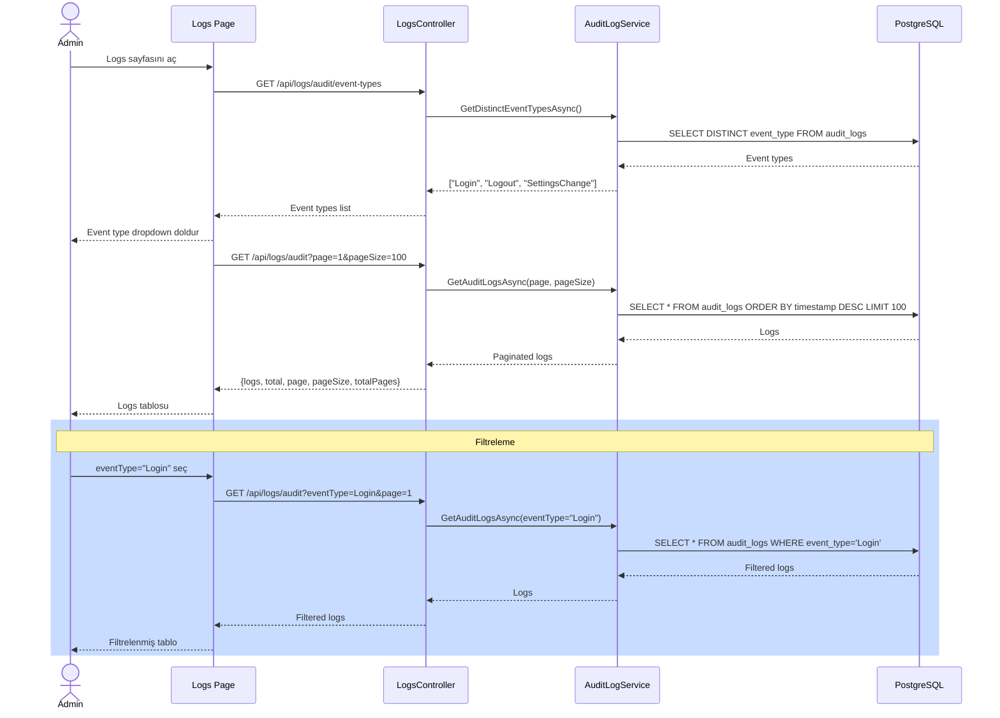

---

## 9. System Architecture (Component Diagram)

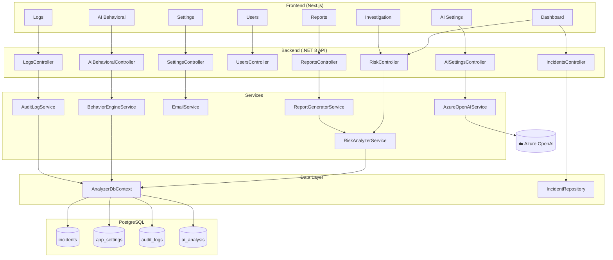

---

## 10. Risk Score Calculation (SLAYT İÇİN KOMPAKT)

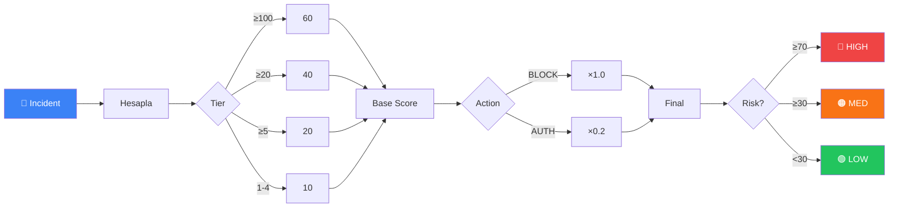

---

## 10b. Risk Score (KARE FORMAT - 16:9 Slayt)

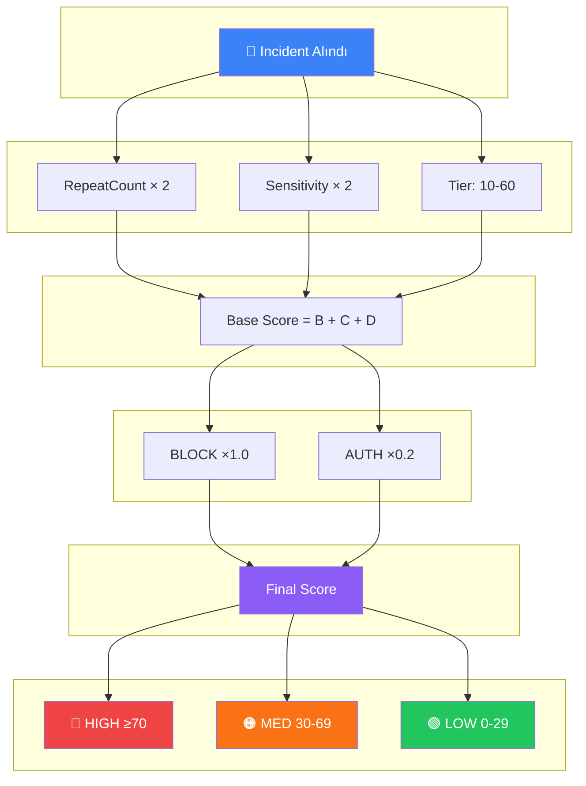

---

## 10c. Risk Score (EN KOMPAKT - Tek Satır)

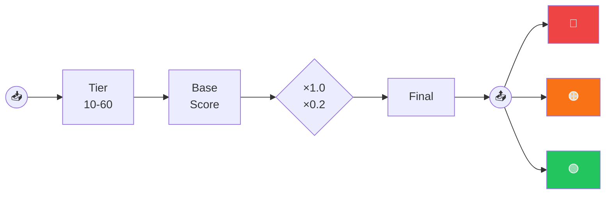

---

## 📌 Kullanım Kılavuzu

### Sunum için PNG/SVG İndirme

1. **Mermaid Live Editor'ı açın:** https://mermaid.live/
2. Yukarıdaki kod bloklarından birini kopyalayın
3. Editor'a yapıştırın
4. Sağ üstteki **Actions → Export as PNG/SVG** seçin
5. İndirilen dosyayı PowerPoint/Google Slides'a ekleyin

### GitHub'da Otomatik Render

GitHub markdown dosyalarında `mermaid` kod blokları otomatik olarak render edilir.

### VS Code'da Görüntüleme

"Markdown Preview Mermaid Support" eklentisini yükleyin.
