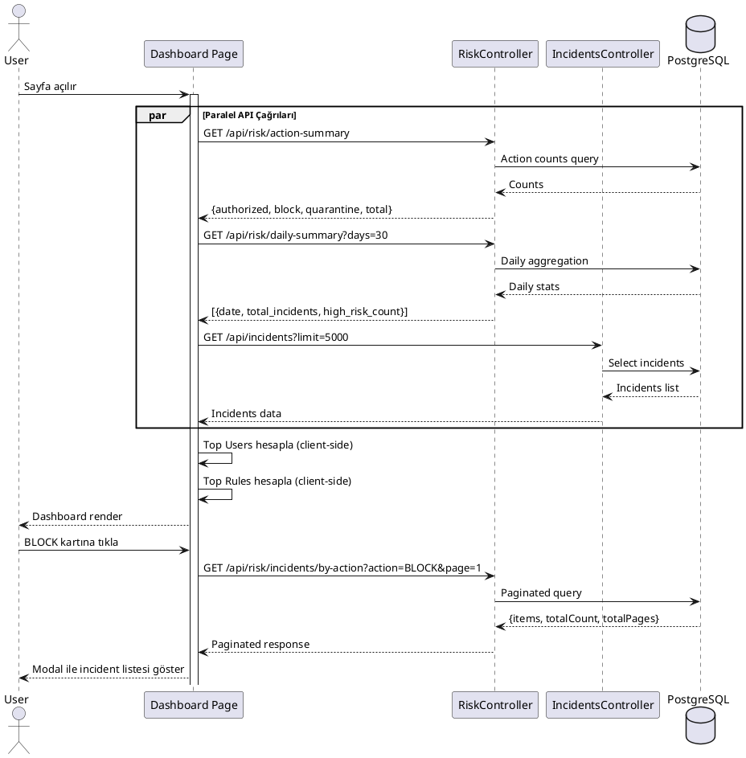
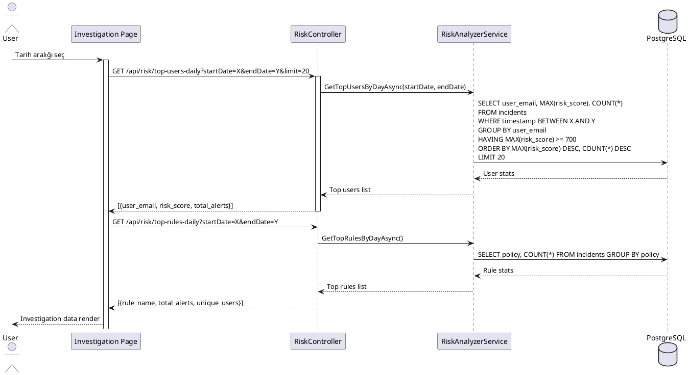
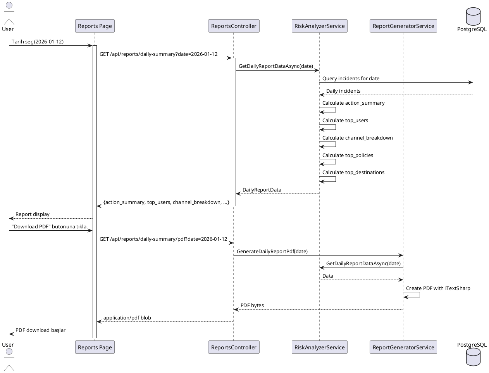
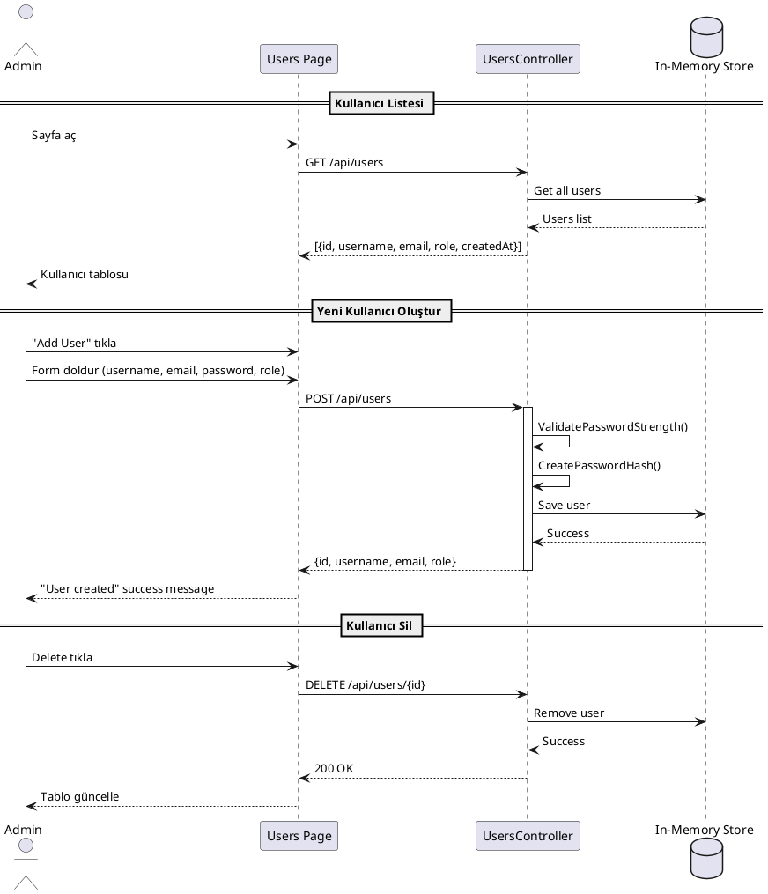
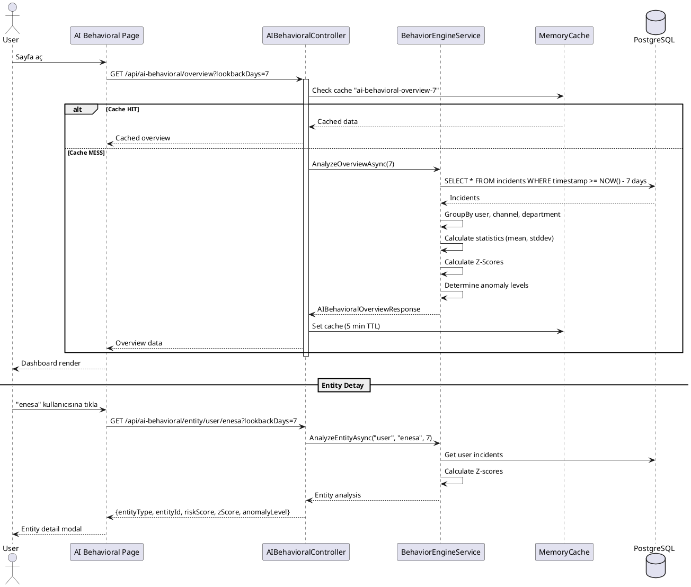
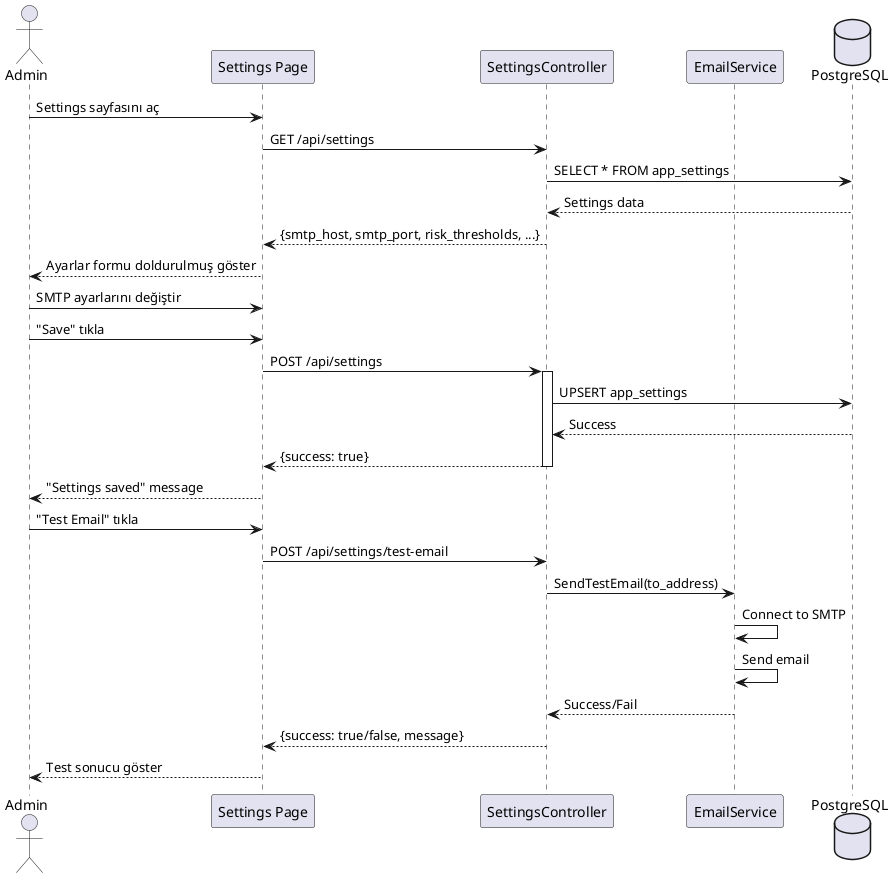
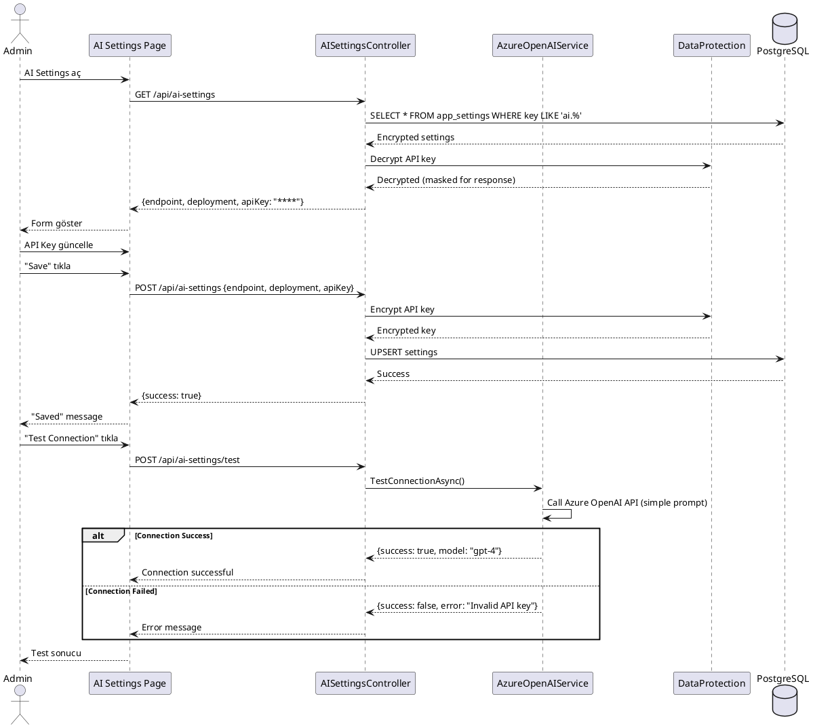
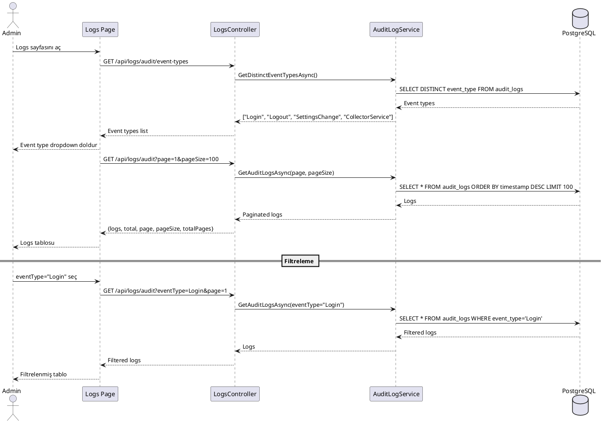
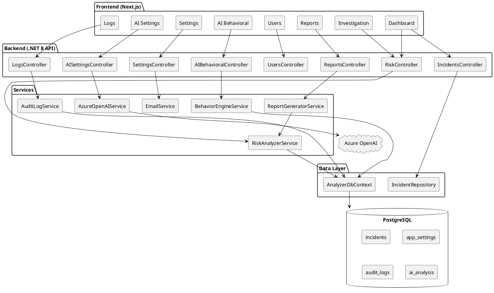
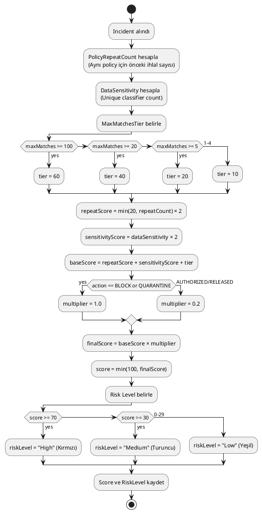

# DLP Risk Analyzer - Sunum Dokümantasyonu

## 📋 Proje Özeti

**DLP Risk Adaptive Protection** sistemi, Forcepoint DLP'den gelen veri kaybı önleme olaylarını (incidents) analiz eden, risk skorları hesaplayan ve davranışsal anomalileri tespit eden kapsamlı bir güvenlik platformudur.

### Teknoloji Yığını
- **Backend:** .NET 8 (C#) Web API
- **Frontend:** Next.js 14 (React/TypeScript)
- **Database:** PostgreSQL
- **Cache/Message Queue:** Redis
- **AI Integration:** Azure OpenAI (GPT-4)

---

## 🏠 1. Dashboard Sayfası

### Açıklama
Ana kontrol paneli sayfası. Tüm DLP incident'larının özet görünümünü, risk analizlerini ve trend verilerini gösterir.

### Gösterilen Veriler
- **Action Summary Cards:** AUTHORIZED, BLOCK, QUARANTINE, RELEASED, TOTAL sayıları
- **Top Users (Son 24 saat):** En yüksek risk skoruna sahip kullanıcılar
- **Data Movement (30 Gün):** Kanal bazlı veri hareketi grafiği
- **Top Matched Rules:** En çok tetiklenen DLP kuralları
- **Daily Incident Trends:** Günlük incident tablosu

### API Endpoints

| Endpoint | Method | Açıklama |
|----------|--------|----------|
| `/api/risk/action-summary` | GET | Action bazlı incident sayıları |
| `/api/risk/daily-summary` | GET | Günlük özet istatistikler |
| `/api/risk/department-summary` | GET | Departman bazlı özet |
| `/api/incidents` | GET | Incident listesi (filtrelenebilir) |
| `/api/risk/incidents/by-action` | GET | Action'a göre incident'lar (pagination) |

### PlantUML - Sequence Diagram


---

## 🔍 2. Investigation Sayfası

### Açıklama
Detaylı araştırma sayfası. Tarih aralığına göre filtrelenebilen, en riskli kullanıcılar ve en çok tetiklenen kuralları gösteren sayfa.

### Özellikler
- Tarih aralığı seçimi (DatePicker)
- Top 20 Risky Users (Risk skoruna göre sıralı)
- Top Alerts (Kural bazlı)
- Incident timeline grafiği

### API Endpoints

| Endpoint | Method | Açıklama |
|----------|--------|----------|
| `/api/risk/top-users-daily` | GET | Tarih aralığında en riskli kullanıcılar |
| `/api/risk/top-rules-daily` | GET | Tarih aralığında en çok tetiklenen kurallar |
| `/api/risk/daily-summary` | GET | Günlük özet (timeline için) |

### PlantUML - Sequence Diagram


---

## 📊 3. Reports Sayfası

### Açıklama
Günlük raporlama sayfası. Seçilen bir gün için detaylı DLP raporu görüntüler ve PDF olarak indirilmesini sağlar.

### Özellikler
- Tek gün seçimi
- Action Summary (günlük)
- Top 10 Users (günlük)
- Channel Breakdown
- Top 10 Policies with Rules
- Top 10 Destinations
- PDF Export

### API Endpoints

| Endpoint | Method | Açıklama |
|----------|--------|----------|
| `/api/reports/daily-summary` | GET | Günlük detaylı özet (JSON) |
| `/api/reports/daily-summary/pdf` | GET | Günlük rapor PDF |
| `/api/reports` | GET | Oluşturulan raporlar listesi |
| `/api/reports/summary` | GET | Özet rapor PDF (tarih aralığı) |

### PlantUML - Sequence Diagram


---

## 👥 4. Users Sayfası

### Açıklama
Sistem kullanıcıları (admin'ler) yönetim sayfası. Kullanıcı oluşturma, düzenleme, silme işlemleri yapılır.

### Özellikler
- Kullanıcı listesi
- Yeni kullanıcı oluşturma (username, email, password, role)
- Kullanıcı düzenleme
- Kullanıcı silme
- Rol yönetimi (admin, viewer, analyst)

### API Endpoints

| Endpoint | Method | Açıklama |
|----------|--------|----------|
| `/api/users` | GET | Tüm kullanıcıları listele |
| `/api/users/{id}` | GET | Tek kullanıcı detayı |
| `/api/users` | POST | Yeni kullanıcı oluştur |
| `/api/users/{id}` | PUT | Kullanıcı güncelle |
| `/api/users/{id}` | DELETE | Kullanıcı sil |

### PlantUML - Sequence Diagram


---

## 🤖 5. AI Behavioral Sayfası

### Açıklama
Yapay zeka tabanlı davranış analizi sayfası. Z-score ile anomali tespiti yapar, kullanıcı/kanal/departman bazlı risk analizi sunar.

### Özellikler
- Overview Dashboard (cachelendi - 5 dk)
- Entity Analysis (user, channel, department)
- Top Anomalies listesi
- Z-Score hesaplama (son 7/14/30 gün)
- Anomaly Level: Normal, Low, Medium, High, Critical

### API Endpoints

| Endpoint | Method | Açıklama |
|----------|--------|----------|
| `/api/ai-behavioral/overview` | GET | Genel bakış (cached) |
| `/api/ai-behavioral/analyze` | POST | Entity analiz et |
| `/api/ai-behavioral/entity/{type}/{id}` | GET | Entity analizi getir |
| `/api/ai-behavioral/anomalies` | GET | Top anomaliler listesi |

### Z-Score Hesaplama Formülü
```
Z-Score = (X - μ) / σ
Burada:
- X = Güncel değer (incident count, max_matches, vb.)
- μ = Ortalama (mean)
- σ = Standart sapma (standard deviation)

Anomaly Levels:
- Normal: |z| < 1.5
- Low: 1.5 ≤ |z| < 2.0
- Medium: 2.0 ≤ |z| < 2.5
- High: 2.5 ≤ |z| < 3.0
- Critical: |z| ≥ 3.0
```

### PlantUML - Sequence Diagram


---

## ⚙️ 6. Settings Sayfası

### Açıklama
Sistem ayarları sayfası. Email bildirimleri, risk eşikleri, veritabanı bağlantı ayarları yapılır.

### Özellikler
- Email Notification Settings (SMTP)
- Risk Thresholds (High, Medium, Low)
- Database Connection Test
- Test Email gönderme

### API Endpoints

| Endpoint | Method | Açıklama |
|----------|--------|----------|
| `/api/settings` | GET | Tüm ayarları getir |
| `/api/settings` | POST | Ayarları kaydet |
| `/api/settings/test-email` | POST | Test email gönder |

### PlantUML - Sequence Diagram


---

## 🧠 7. AI Settings Sayfası

### Açıklama
Azure OpenAI entegrasyon ayarları sayfası. API key, endpoint, model ayarları yapılır.

### Özellikler
- Azure OpenAI Endpoint
- API Key (şifrelenmiş saklanır)
- Deployment Name (gpt-4, gpt-35-turbo)
- Connection Test
- Model selection

### API Endpoints

| Endpoint | Method | Açıklama |
|----------|--------|----------|
| `/api/ai-settings` | GET | AI ayarlarını getir |
| `/api/ai-settings` | POST | AI ayarlarını kaydet |
| `/api/ai-settings/test` | POST | Bağlantı testi |

### PlantUML - Sequence Diagram


---

## 📝 8. Logs Sayfası

### Açıklama
Sistem logları görüntüleme sayfası. Audit logları ve uygulama loglarını gösterir.

### Özellikler
- Audit Logs (kullanıcı işlemleri)
- Application Logs (sistem logları)
- Event Type filtreleme
- Tarih aralığı filtreleme
- Pagination

### API Endpoints

| Endpoint | Method | Açıklama |
|----------|--------|----------|
| `/api/logs/audit` | GET | Audit logları (paginated) |
| `/api/logs/audit/event-types` | GET | Event tipleri listesi |
| `/api/logs/application` | GET | Uygulama logları |
| `/api/logs/application/collector` | POST | Collector log kaydet (internal) |

### PlantUML - Sequence Diagram


---

## 🏗️ Genel Sistem Mimarisi

### PlantUML - Component Diagram


---

## 🔄 Risk Score Hesaplama

### Formül
```
BaseScore = (PolicyRepeatCount × 2) + (DataSensitivity × 2) + MaxMatchesTier
FinalScore = BaseScore × ActionMultiplier
Score = min(100, FinalScore)

MaxMatchesTier:
- 1-4: 10
- 5-19: 20
- 20-99: 40
- 100+: 60

ActionMultiplier:
- BLOCK/QUARANTINE: 1.0
- AUTHORIZED/RELEASED: 0.2
```

### PlantUML - Activity Diagram


---

## 📌 Notlar

1. **Pagination:** Action modal'da server-side pagination uygulandı (100 kayıt/sayfa, max 500)
2. **Caching:** AI Behavioral overview 5 dakika cache'lenir
3. **Security:** API key'ler DataProtection ile şifrelenir
4. **Performance:** Investigation Top Users risk skoruna göre sıralanır
